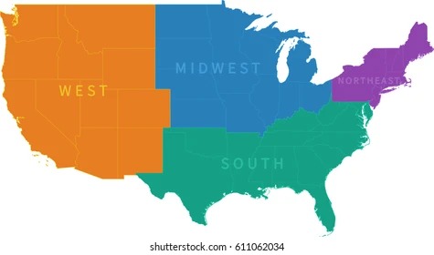
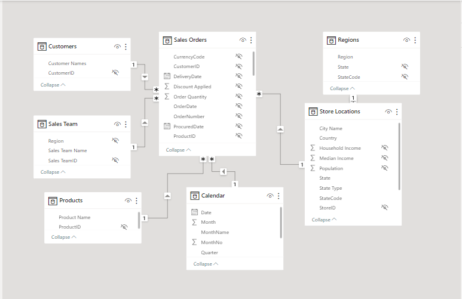
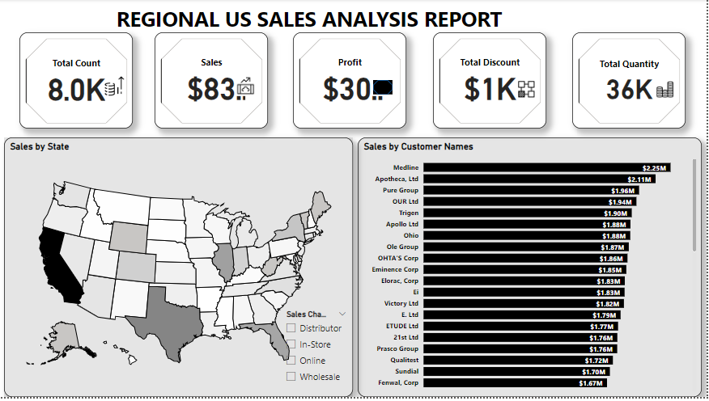
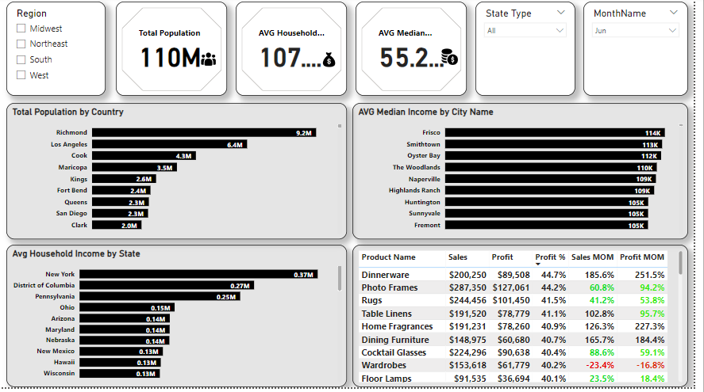
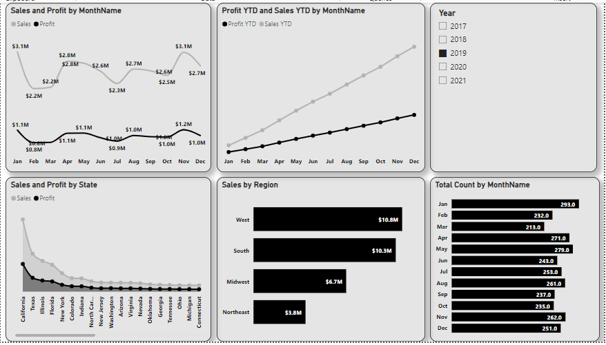

# Regional Sales-Analysis-Report

 

This sales analysis report in Power BI outlines the status of sales activities within the regions of United States. It shows the trends in sales over time and also analyzes the various stages of the sales funnel and sales teams. They provide a snapshot of the region's workouts at a particular moment, assessing the situation, making the best decisions, and determining the type of behavior to perform.

## Problem Statement
1. What region generated the hightest sales?
2. What country have the highest population?
3. In which year and month did they generate the hightest sales and profit?
4. What are the best perfoming products?
5. Who are best perfoming customers?

   

## Skills/ Concepts Demostrated
The following power BI features was incorporated:
- Data Cleaning
- Data Transformation
- Dax 
- Page Navigation
- Button
- Filters
- Shapes
- Icons
- Tooltips

## Modelling
The model is a star schema and it contain seven dimensional tables that includes fact table, customer table, sales team table, products table, regions table, location table and calendar table.

## Visualization
The report comprises of three pages and you can interact with the report [here](https://app.powerbi.com/view?r=eyJrIjoiNjk5YzEyOTEtYzVhZi00MGEzLWFhZjctY2U4YmRiN2ZhMTBkIiwidCI6ImNmYTI1N2FmLTk1N2EtNDU3Ny05MWIyLTU4ZjYwMDgzZmYyZSJ9
)

## Analysis of the Report

